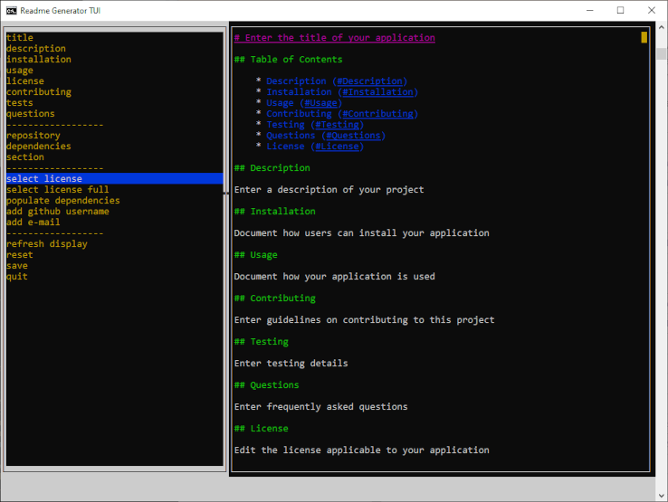
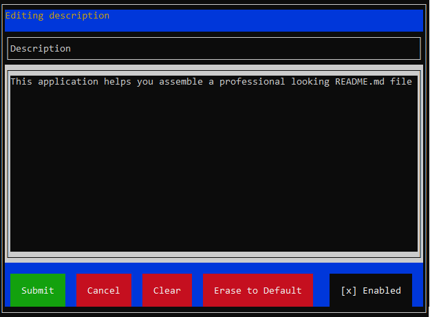

# README Generator

## Table of Contents

- [Description](#Description)
- [Installation](#Installation)
- [Usage](#Usage)
- [Contributing](#Contributing)
- [Questions](#Questions)
- [Dependencies](#Dependencies)

## Description

This application will help you assemble a complete README.md for your project. It is run from the command line and uses the blessed terminal library (an implemntation of ncurses for nodejs).

## Installation

- Clone from git repository
- $ npm install

## Usage

Start the application\
$ node index.js

Left window: Menu options\
Righ window: The right pane displays the README markdown

Use the left menu bar to choose readme sections to edit.

Navigate using the following keyboard keys:
- Up / Down arrows : Move menu selection / scroll up/down
- Tab : Switch between left and right windows
- Enter : Choose the selected menu item
- Esc : Go back or cancel
- 'q' : Quit program

### Menu options:

#### Section editor menu options

Navigating the section editor
- Up / Down arrows: Move among different input areas and buttons
- Enter: Choose the selected button or input area
- **Submit** button: Save the section information
- **Cancel** button: Go back to the main menu
- **Clear** button: Clears all information from this section. NOTE: It also *disables* the section.
- **Erase to Default** button: Sets the section information back to its default value
- **Enabled** checkbox: Enables / Disables the section. Disabled sections will not be included in the assembled README

The following menu options take you to the section editor:
- **title** : Add the title in the content text area window
- **description** : Edit a description of your application
- **installation** : Edit a description on how to install your app
- **usage** : Enter a description on how users can use your application
- **license** : Edit the selected license manually
- **contributing** : Enter any information for people who wish to contribute to the project
- **tests** : Enter a description on any testing procedure details
- **questions** : Enter frequently asked questions or information on how to contact the author
- **repository** : Manually edit the application's repository information
- **dependencies** : Manually edit the dependencies section
- **section** : Edit an additional custom section to the README

#### Utility menu options

The following menu options has the following functions:
- **select license** : Select a license from a popular set of open-source licenses
- **select license full** : Select a license from a longer list of open-source licenses
- **populate dependencies** : Populates your **Dependencies** section from your package.json file
- **add github username** : Adds a link to your github profile page in the **Questions** section.
- **add e-mail** : Adds a link to your e-mail in the **Questions** section.
- **refresh display** : Refreshes the right window and re-renders the markdown
- **reset** : Resets all section information to default
- **save** : Requests a filename and saves the data. 
- **quit** : Exit this application

### Walkthrough Videos

[Walkthrough video](https://drive.google.com/file/d/114-SoFDuNDbNX2-cEVXnBjtJzROsGvkQ/view?usp=sharing)\
[Walkthrough video (github)](assets/readmegenerator_walkthrough.mp4)

[Markdown in browser video](https://drive.google.com/file/d/116PEoO-PiOkAfABfWxBCjz9EJp5tAejG/view?usp=sharing)\
[Markdown in browser video (github)](assets/readmegenerator_readmelinks.mp4)

## Contributing

Feel free to contribute to this application.

## Questions

Post your questions in the "issues" section in the GitHub repository\
GitHub repository: https://github.com/andrenrwn/readme-generator

## Credits & Dependencies

[How to create a Professional README](https://coding-boot-camp.github.io/full-stack/github/professional-readme-guide)

- blessed: "^0.1.81" - text user interface widgets and windowing tools
- neo-blessed: latest
- blessed-contrib: ^4.11.0 - text markdown renderer
- inquirer: ^8.0.0 - easy to use node prompts
